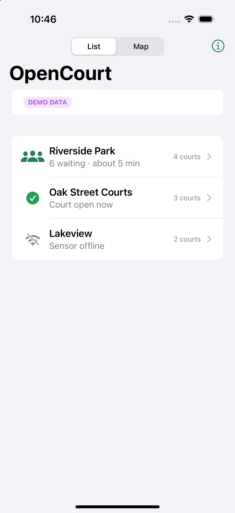
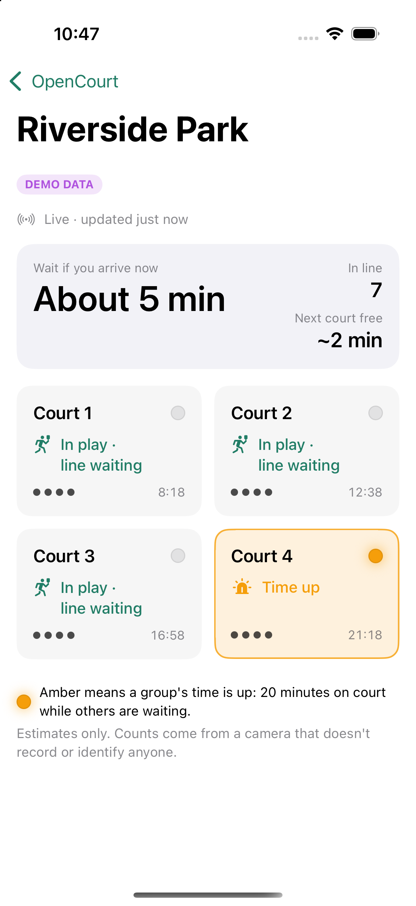
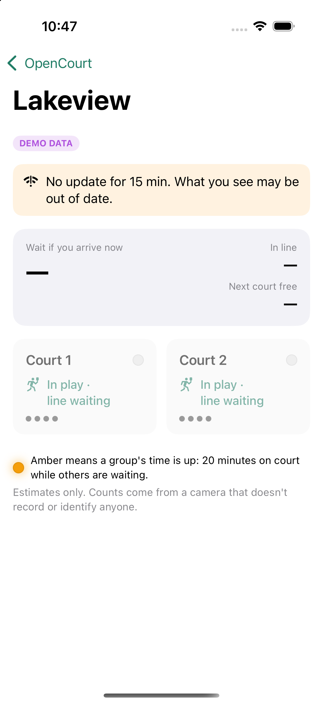
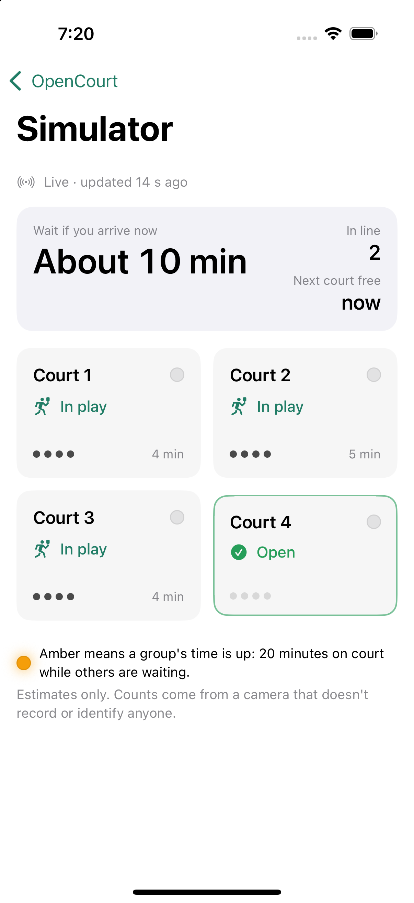

# OpenCourt: what's built, how to test it, what's left

*Last updated 2026-09-17.* For design decisions, see [`PLAN.md`](PLAN.md).

---

## What the tests actually ran on (no real videos yet)

**No footage of real courts has been used.** Nothing has been filmed. What exists is:

1. **A simulated court** (`sensor/src/opencourt/sim.py`). It doesn't produce video at all.
   It produces what the camera software *would* produce: a list of "there's a person at
   this spot, with this temporary tracker number" for each frame, plus the ground truth
   (which group is really on which court). It models 2, 4, 8 or more courts, groups that
   leave and are replaced directly, groups that shift up, parties of 1–4 merging into
   foursomes, water breaks, ball chases, bystanders, and the messiness of real tracking
   (missed people, ID numbers changing, ghost detections). All the accuracy numbers in these
   docs come from this.
2. **One 20-second synthetic clip** made by slowly panning a stock photo of people at a bus
   stop (the sample image that ships with the YOLO library). It was used once to confirm
   the detector and tracker run end to end and give stable IDs. That's all.

So the simulator proves the *logic*; the first real test of the *vision* is your first
recording at Rick Drazner Park.

---

## The big picture

```
 ┌──────────── at the court ────────────┐        ┌── cloud ──┐       ┌── phone ──┐
 │ camera → Raspberry Pi 5              │        │ Supabase  │       │ iOS app   │
 │   1. find people (YOLO + ByteTrack)  │  counts │ database  │ live  │ courts,   │
 │   2. which zone is each person in?   │ ──────▶ │ + REST    │ ────▶ │ line,     │
 │   3. follow the line of groups       │ & states│ + realtime│       │ wait time │
 │   4. clock per group → amber light   │        └───────────┘       └───────────┘
 └──────────────────────────────────────┘
      frames never leave the Pi's memory
```

Everything that decides *when a light turns on* is plain Python with no camera code. So it
can be tested with a **simulated court** long before any footage or hardware exists.

---

## 0. Where everything is, and how to get at it

| What | Where | How to see it working |
|---|---|---|
| Decision logic ("the engine") | `sensor/src/opencourt/` — `line.py` is the heart | `cd sensor && uv run opencourt simulate --speed 20` |
| Simulator + scoring | `sensor/src/opencourt/sim.py`, `evaluate.py` | `uv run opencourt simulate --report --courts 2 --shift-up 0` |
| Camera / detector / lights / Pi service | `sensor/src/opencourt/{capture,detect,lights,runner}.py`, `sensor/systemd/` | Needs the Pi, or a video file: `uv run opencourt replay clip.mp4 --show` |
| Zone calibration tool | `sensor/src/opencourt/calibrate.py` | `uv run opencourt calibrate --source clip.mp4 --courts 2` |
| Database schema + security | `supabase/migrations/…_init.sql` | `cd backend && uv run pytest` |
| iPhone app | `ios/OpenCourt.xcodeproj` (views in `ios/OpenCourt/Views/`) | Open in Xcode, press Run (demo data) |
| Shared app logic (models, formatting, live data) | `ios/OpenCourtKit/` | `cd ios/OpenCourtKit && swift test` |
| Design + decisions | `docs/PLAN.md` | — |
| Tests, all at once | `scripts/test-all.sh` | — |

Everything under `sensor/` is Python, run through `uv` (`source scripts/env.sh` first).
Everything under `ios/` is Swift. `supabase/` is SQL.

---

## 1. Sensor (`sensor/`): the brain

### How it thinks, step by step

1. **Detection.** YOLO finds people in each frame. ByteTrack gives each person a
   temporary number, based only on where their box moves. That number is forgotten
   within seconds.
2. **Zones.** Each person's feet are checked against the polygons you draw once per park:
   Court 1…N, the line at the entrance, and everything else.
3. **Counts.** People per court and in line, smoothed so one bad frame changes nothing.
4. **Crossings.** "Someone went from Court 2 to Court 3." Short trips off the court,
   like chasing a ball, are ignored.
5. **Who is on each court** (`line.py`). It doesn't assume how the park rotates:
   - When a court **empties**: if people were seen stepping onto the open court above,
     the group **moved up**, taking its clock (and light) with it. Otherwise it **left**.
   - When a court **fills**: if a group's worth of people came **off the line** (whichever
     court they walked to), it's a **new group** with a fresh clock. Only with clear
     evidence is it the group from below moving up, or the same group back from a break.
   - When unsure, it's a **fresh clock**. Being unsure can delay a light, never cause one.
   - A **quick swap**, where a court never looks empty, is caught from crossings alone.
6. **Clock and light.** Each group's clock only runs while someone is waiting in line.
   - At 18 minutes the light pulses ("Almost time").
   - At 20 minutes it is solid amber ("Time up").
   - The light turns off while groups are changing, whenever the camera has problems, and
     when nobody is waiting.
7. **Output.** Lights (GPIO), a status snapshot sent to the backend, and a
   once-a-minute history log of counts and states only.

### Try it yourself

```bash
cd ~/Developer/OpenCourt
source scripts/env.sh
cd sensor
```

**Watch a simulated session** (4 courts, 50 minutes, printed as it happens):

```bash
uv run opencourt simulate --courts 4 --minutes 50 --seed 4 --lane-outside --print-every 300
```

What you'll see (real output):

```
[   2.7 min] group left court 4
[   3.4 min] group moved up court 3 -> 4 (clock follows)
[   3.7 min] group moved up court 2 -> 3 (clock follows)
[   3.8 min] group moved up court 1 -> 2 (clock follows)
   5.0 min | queue  3 | wait  10m | C1 empty   C2 active 4.0m   C3 active 4.0m   C4 active 4.0m
[   6.3 min] new group on court 1
...
  35.0 min | queue  4 | wait   3m | C1 active 7.4m   C2 active 7.4m ...
```

Useful options:

- `--speed 20` plays it at 20× real time and shows the light changes.
- `--courts 2` or `--courts 8` changes the size of the bank.
- `--shift-up 0` means groups never shift up (a new group takes the freed court, like a
  2-court park); `--shift-up 1` means they always do; the default is a mix.
- `--lane-outside` draws the zones without the walking lane. Leave it out for the harder
  case where the lane is part of each court's zone.

**Score the engine** against the simulator's ground truth:

```bash
uv run opencourt simulate --courts 4 --seed 4 --lane-outside --report
```

```
departures: truth=23 detected=23 matched=22 recall=0.96 precision=0.96
false DUE: 0.0 min   missed DUE: 0.0 min
first-game groups lit DUE: 0 (policy alone would light 0)
overstaying groups: 5  should light: 3  lit: 3
```

How to read it:

- **recall**: the share of real departures the engine noticed.
- **precision**: the share of the departures it reported that really happened.
- **false DUE**: minutes of amber on a group whose time wasn't up. This is the number
  that matters most, and it should stay at 0.
- **should light / lit**: overstaying groups that crossed 20 minutes while people waited,
  and how many of them actually got the light.

**Run the unit and regression tests** (about 130 tests; the full run simulates dozens of
2-hour sessions and takes ~7 minutes, so add `-m "not slow"` for the 15-second version):

```bash
uv run pytest
```

### Once you have footage

```bash
uv sync --extra vision                                         # YOLO + OpenCV (one time)
uv run opencourt calibrate --source data/footage/clip.mp4 --courts 4 --out config/zones.yaml
uv run opencourt replay data/footage/clip.mp4 --show --events data/clip.events.jsonl
uv run opencourt evaluate --labels labels/clip.yaml --events data/clip.events.jsonl --games
```

- `calibrate` shows one frame. Click the corners of each court, then the line area.
  Numbering starts at the entrance.
- `replay --show` opens a window that draws zones, feet, counts, and states over the
  video. Nothing is saved.
- `evaluate` compares what the engine saw with your hand labels
  (`sensor/labels/README.md` explains how to label) and reports how long real games last.

The detector has already been checked on a sample image: it found 4 people with stable
IDs, at about 25 FPS on this Mac.

---

## 2. Backend (`backend/`): the mailbox

A Supabase (Postgres) database:

- The Pi posts snapshots through one function, `ingest_status`. It uses its own secret
  token and never the admin key.
- The app can **only read**.
- Anything older than 60 seconds shows as "offline."
- There is no video, no identities, and no per-person data.

```bash
cd backend && uv run pytest        # 16 tests on a temporary local Postgres, no Docker needed
```

The tests check that:

- the Pi can publish;
- wrong or revoked tokens are rejected;
- one device can't write another site's data;
- the public can't write anything or see device tokens;
- stale data is flagged;
- a real payload produced by the sensor is accepted.

---

## 3. iOS app (`ios/`): the window

Open `ios/OpenCourt.xcodeproj` in Xcode, pick an iPhone simulator, and press Run. With no
backend configured, it shows **demo data** and says so on screen.

| Sites (demo) | A court whose time is up (demo) | Sensor offline (demo) | Live from Supabase |
|---|---|---|---|
|  |  |  |  |

With `ios/Config/Secrets.xcconfig` filled in (it is), the app reads your real Supabase
project instead: the real parks appear as "No data yet" until a sensor reports, and the
"Simulator" site goes live whenever `opencourt simulate --publish` is running.

- Each court card shows its state, the players seen on it, the time on court while people
  waited, and a dot that mirrors the real light (off, pulsing, or solid).
- When the sensor goes quiet, the numbers grey out and a banner says so. The app never
  pretends stale data is live.
- Launch arguments for testing, set in Xcode under Scheme → Arguments:
  - `-demo` forces demo data;
  - `-openSite demo-riverside` opens that site directly;
  - `-demoMinutes 4` fast-forwards the demo so a court shows "Time up."

```bash
cd ios/OpenCourtKit && swift test   # 20 tests: decoding, staleness, wording, clocks, store
```

---

## 4. Test everything at once

```bash
scripts/test-all.sh          # sensor + backend + Swift kit
scripts/test-all.sh --fast   # skip the 2-hour simulations
```

---

## 5. What's left

### Needs you, at a court

- [ ] **Email Buffalo Grove Park District.** Ask for permission to film for development,
      and to run a supervised pilot. Include the privacy notes from PLAN §3.
- [ ] **Record 30–60 minutes at Rick Drazner Park** (2 courts) to check camera height,
      reach, and zone drawing. Then **1–2 hours at Mike Rylko** (8 courts) while people
      are waiting; try two camera positions.
- [ ] **Label** departures and game start/end times (`sensor/labels/README.md`).
- [ ] Decide the **light layout** (one per court, or a panel at the line) after seeing
      the site.

### Needs a quick setup from you

- [x] **Supabase:** schema applied, sites seeded, simulator device registered, app and
      simulator connected (2026-09-17). `cd sensor && uv run opencourt simulate -c config/local.yaml
      --publish --site sim-site --speed 8` feeds the live database; the app (built with
      `ios/Config/Secrets.xcconfig` in place) shows it under "Simulator".
- [ ] **Buy the hardware** (PLAN §8): a Pi 5, Camera Module 3 Wide, a mount, 12 V amber
      lights, and MOSFETs.
- [ ] Optional: join the **Apple Developer Program** if you want TestFlight. A free account
      is enough to run the app on your own phone.

### Software still to build

| Item | Blocked on |
|---|---|
| Tune the line model on real footage | Footage + labels |
| Pi setup: NCNN export, FPS check, GPIO lights, systemd service | Hardware |
| Multi-camera support for 8+ court banks | Design work (PLAN §12) |
| Game-end detection (paddle tap), then maybe score tracking | Prototype running first (PLAN §12) |
| Map polish, push notifications, busy-hour history | Later |
| Weatherproof enclosure, posted privacy sign | Pilot approval |

### Known limits today

- Everything is proven only against the **simulator**. Real footage will surprise us.
- **8 courts in one camera view with a strict cascade** is the weak case: up to about 3
  minutes of wrong amber per 2 hours, and some overstayers missed. Direct replacement at
  8 courts, and everything at 2 and 4 courts, had none.
- **Zone drawing matters.** If the walking lane has to be inside the court zones, the
  engine plays it safe (fresh clocks), which delays some lights.
- The 20-minute rule will occasionally light a group that is simply having a long first
  game. Game-end detection is how that eventually goes away.
