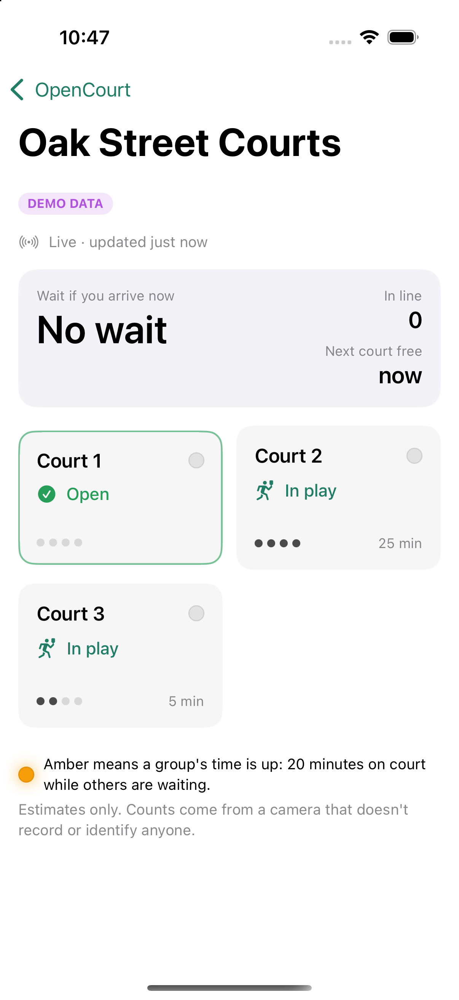

# OpenCourt: what's built, how to test it, what's left

*Last updated 2026-09-16.* For design decisions, see [`PLAN.md`](PLAN.md).

---

## The big picture

```
 ┌──────────── at the court ────────────┐        ┌── cloud ──┐       ┌── phone ──┐
 │ camera → Raspberry Pi 5              │        │ Supabase  │       │ iOS app   │
 │   1. find people (YOLO + ByteTrack)  │  counts │ database  │ live  │ courts,   │
 │   2. which zone is each person in?   │ ──────▶ │ + REST    │ ────▶ │ line,     │
 │   3. follow the line of groups       │ & states│ + realtime│       │ wait time │
 │   4. clock per group → amber light   │        └───────────┘       └───────────┘
 └──────────────────────────────────────┘
      frames never leave the Pi's memory
```

Everything that decides *when a light turns on* is plain Python with no camera code. So it
can be tested with a **simulated court** long before any footage or hardware exists.

---

## 1. Sensor (`sensor/`): the brain

### How it thinks, step by step

1. **Detection.** YOLO finds people in each frame. ByteTrack gives each person a
   temporary number, based only on where their box moves. That number is forgotten
   within seconds.
2. **Zones.** Each person's feet are checked against the polygons you draw once per park:
   Court 1…N, the line at the entrance, and everything else.
3. **Counts.** People per court and in line, smoothed so one bad frame changes nothing.
4. **Crossings.** "Someone went from Court 2 to Court 3." Short trips off the court,
   like chasing a ball, are ignored.
5. **The line of groups** (`line.py`). The groups on the courts are an ordered list:
   - When a court **empties** and people were seen stepping onto the open court above,
     the group **moved up**, taking its clock (and light) with it.
   - Otherwise the group **left**.
   - When a court **fills**, the newcomers are one of: the group moving in, a new group
     from the line, the same group back from a break, or, if unsure, a new group with a
     fresh clock.
   - A **quick swap**, where a court never looks empty, is caught from crossings alone.
6. **Clock and light.** Each group's clock only runs while someone is waiting in line.
   - At 18 minutes the light pulses ("Almost time").
   - At 20 minutes it is solid amber ("Time up").
   - The light turns off while groups are changing, whenever the camera has problems, and
     when nobody is waiting.
7. **Output.** Lights (GPIO), a status snapshot sent to the backend, and a
   once-a-minute history log of counts and states only.

### Try it yourself

```bash
cd ~/Developer/OpenCourt
source scripts/env.sh
cd sensor
```

**Watch a simulated session** (4 courts, 50 minutes, printed as it happens):

```bash
uv run opencourt simulate --courts 4 --minutes 50 --seed 4 --lane-outside --print-every 300
```

What you'll see (real output):

```
[   2.7 min] group left court 4
[   3.4 min] group moved up court 3 -> 4 (clock follows)
[   3.7 min] group moved up court 2 -> 3 (clock follows)
[   3.8 min] group moved up court 1 -> 2 (clock follows)
   5.0 min | queue  3 | wait  10m | C1 empty   C2 active 4.0m   C3 active 4.0m   C4 active 4.0m
[   6.3 min] new group on court 1
...
  35.0 min | queue  4 | wait   3m | C1 active 7.4m   C2 active 7.4m ...
```

Useful options:

- `--speed 20` plays it at 20× real time and shows the light changes.
- `--courts 2` or `--courts 8` changes the size of the bank.
- `--lane-outside` draws the zones without the walking lane. Leave it out for the harder
  case where the lane is part of each court's zone.

**Score the engine** against the simulator's ground truth:

```bash
uv run opencourt simulate --courts 4 --seed 4 --lane-outside --report
```

```
departures: truth=23 detected=23 matched=22 recall=0.96 precision=0.96
false DUE: 0.0 min   missed DUE: 0.0 min
first-game groups lit DUE: 0 (policy alone would light 0)
overstaying groups: 5  should light: 3  lit: 3
```

How to read it:

- **recall**: the share of real departures the engine noticed.
- **precision**: the share of the departures it reported that really happened.
- **false DUE**: minutes of amber on a group whose time wasn't up. This is the number
  that matters most, and it should stay at 0.
- **should light / lit**: overstaying groups that crossed 20 minutes while people waited,
  and how many of them actually got the light.

**Run the unit and regression tests** (103 tests, about 2 minutes; add `-m "not slow"` for
about 15 seconds):

```bash
uv run pytest
```

### Once you have footage

```bash
uv sync --extra vision                                         # YOLO + OpenCV (one time)
uv run opencourt calibrate --source data/footage/clip.mp4 --courts 4 --out config/zones.yaml
uv run opencourt replay data/footage/clip.mp4 --show --events data/clip.events.jsonl
uv run opencourt evaluate --labels labels/clip.yaml --events data/clip.events.jsonl --games
```

- `calibrate` shows one frame. Click the corners of each court, then the line area.
  Numbering starts at the entrance.
- `replay --show` opens a window that draws zones, feet, counts, and states over the
  video. Nothing is saved.
- `evaluate` compares what the engine saw with your hand labels
  (`sensor/labels/README.md` explains how to label) and reports how long real games last.

The detector has already been checked on a sample image: it found 4 people with stable
IDs, at about 25 FPS on this Mac.

---

## 2. Backend (`backend/`): the mailbox

A Supabase (Postgres) database:

- The Pi posts snapshots through one function, `ingest_status`. It uses its own secret
  token and never the admin key.
- The app can **only read**.
- Anything older than 60 seconds shows as "offline."
- There is no video, no identities, and no per-person data.

```bash
cd backend && uv run pytest        # 16 tests on a temporary local Postgres, no Docker needed
```

The tests check that:

- the Pi can publish;
- wrong or revoked tokens are rejected;
- one device can't write another site's data;
- the public can't write anything or see device tokens;
- stale data is flagged;
- a real payload produced by the sensor is accepted.

---

## 3. iOS app (`ios/`): the window

Open `ios/OpenCourt.xcodeproj` in Xcode, pick an iPhone simulator, and press Run. With no
backend configured, it shows **demo data** and says so on screen.

| Sites | A court whose time is up | Sensor offline | Quiet park |
|---|---|---|---|
|  |  |  |  |

- Each court card shows its state, the players seen on it, the time on court while people
  waited, and a dot that mirrors the real light (off, pulsing, or solid).
- When the sensor goes quiet, the numbers grey out and a banner says so. The app never
  pretends stale data is live.
- Launch arguments for testing, set in Xcode under Scheme → Arguments:
  - `-demo` forces demo data;
  - `-openSite demo-riverside` opens that site directly;
  - `-demoMinutes 4` fast-forwards the demo so a court shows "Time up."

```bash
cd ios/OpenCourtKit && swift test   # 20 tests: decoding, staleness, wording, clocks, store
```

---

## 4. Test everything at once

```bash
scripts/test-all.sh          # sensor + backend + Swift kit
scripts/test-all.sh --fast   # skip the 2-hour simulations
```

---

## 5. What's left

### Needs you, at a court

- [ ] **Email Buffalo Grove Park District.** Ask for permission to film for development,
      and to run a supervised pilot. Include the privacy notes from PLAN §3.
- [ ] **Record 30 minutes at the 2-court park** to check camera height, reach, and zone
      drawing. Then **1–2 hours at the 4-court park** while people are waiting.
- [ ] **Label** departures and game start/end times (`sensor/labels/README.md`).
- [ ] Decide the **light layout** (one per court, or a panel at the line) after seeing
      the site.

### Needs a quick setup from you

- [ ] **Create a Supabase project** (free tier). Then I can apply the schema, register a
      simulator "device," and connect the app, so the simulator drives your phone live.
- [ ] **Buy the hardware** (PLAN §8): a Pi 5, Camera Module 3 Wide, a mount, 12 V amber
      lights, and MOSFETs.
- [ ] Optional: join the **Apple Developer Program** if you want TestFlight. A free account
      is enough to run the app on your own phone.

### Software still to build

| Item | Blocked on |
|---|---|
| Tune the line model on real footage | Footage + labels |
| Pi setup: NCNN export, FPS check, GPIO lights, systemd service | Hardware |
| Live backend + app end-to-end (`simulate --publish`) | Supabase project |
| Multi-camera support for 8+ court banks | Design work (PLAN §12) |
| Game-end detection (paddle tap), then maybe score tracking | Prototype running first (PLAN §12) |
| Map polish, push notifications, busy-hour history | Later |
| Weatherproof enclosure, posted privacy sign | Pilot approval |

### Known limits today

- Everything is proven only against the **simulator**. Real footage will surprise us.
- **8 courts in one camera view** is the weak case. In busy simulated sessions, groups
  hopping through several open courts caused up to about 5 minutes of wrong amber per
  2 hours. Two and four courts had none.
- The 20-minute rule will occasionally light a group that is simply having a long first
  game. Game-end detection is how that eventually goes away.
